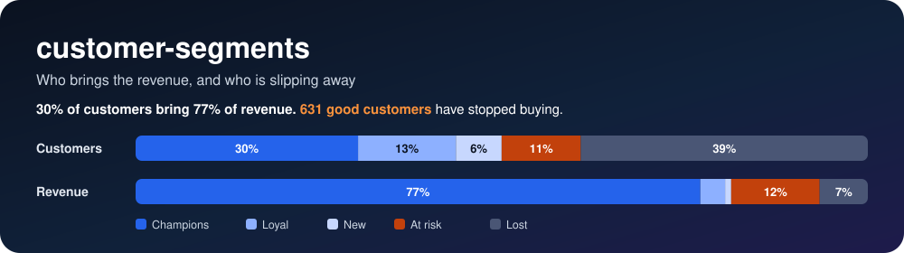
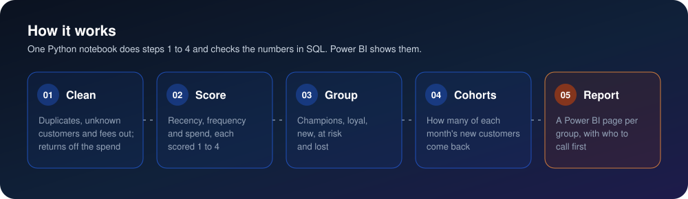
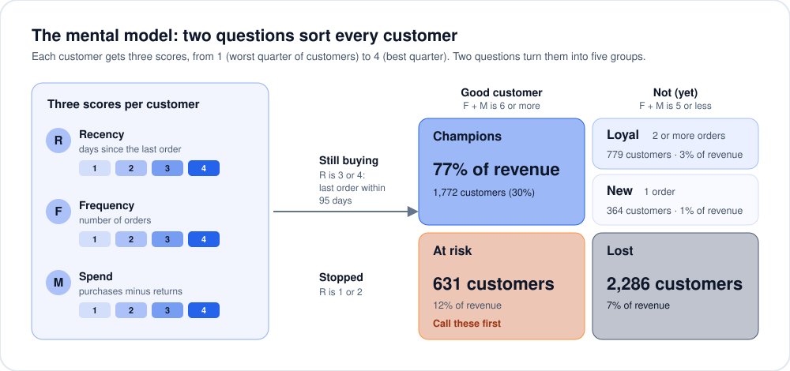
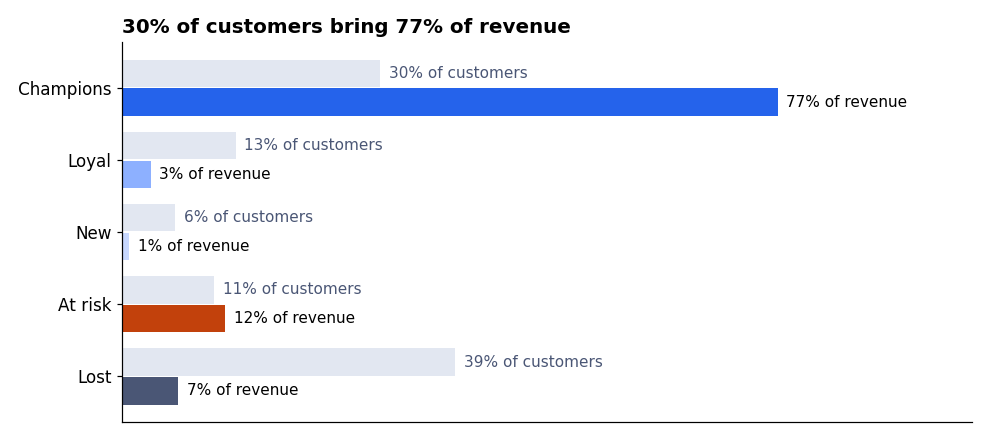
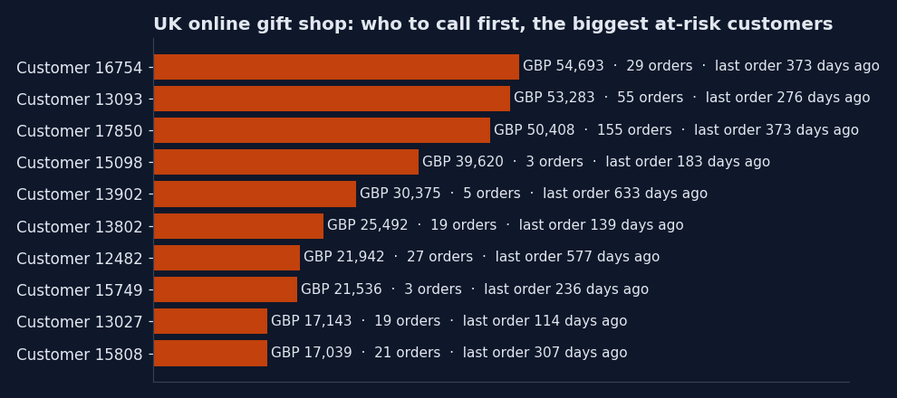
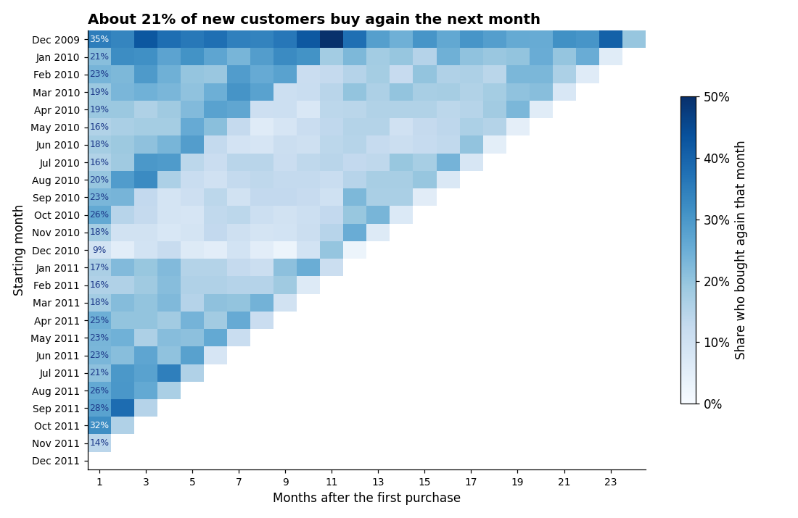
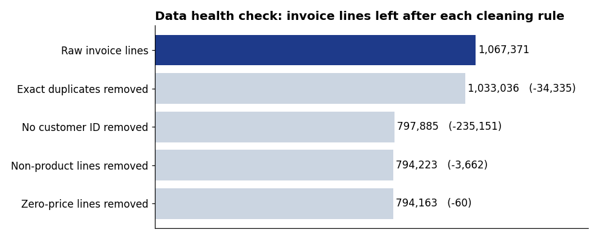

<p align="center">
  
</p>

<p align="center">
  
  
  
  
  
</p>

<h3 align="center">Most of the revenue comes from a third of the customers, and good customers leave quietly.<br>This finds both, and lists who to call first.</h3>

<p align="center">Everything that changes per client is in <code>config/client.yaml</code> and the file in <code>data/input/</code>.</p>

## The problem

A shop treats every customer the same: the same emails, the same discounts, the same follow-up. Money goes on people who would buy anyway, and good customers stop ordering without anyone noticing until their revenue is already gone.

## 🛠️ The answer

Every customer is scored on three things, and two plain questions sort them into five groups. Each group gets its own action, and the at-risk group becomes a call list, biggest spender first.

<p align="center">
  
</p>

<p align="center">
  
</p>

- **Recency:** days since the last order. **Frequency:** number of orders. **Spend:** purchases minus returns.
- Each becomes a score from 1 to 4 by quarters of customers: the best quarter gets 4, ties share a score.
- **Still buying?** Recency score 3 or 4, which here means a last order within 95 days.
- **A good customer?** Frequency score plus spend score is 6 or more.

| | Good customer | Not (yet) |
|---|---|---|
| **Still buying** | **Champions:** keep them close, ask for referrals | **Loyal** (2+ orders): grow the basket · **New** (1 order): earn the second order |
| **Stopped** | **At risk:** call them first | **Lost:** one win-back email, no calls |

## 📈 What it found

| Question | Answer |
|---|---|
| How much was analysed? | 36,573 purchase invoices from 5,832 customers over two years, December 2009 to December 2011 |
| Who brings the revenue? | **Champions: 1,772 customers (30.4%) bring 77.1% of the revenue** |
| Who is slipping away? | **631 good customers (10.8%) have stopped buying.** They brought 12.1% of the revenue; the median one last ordered 226 days ago |
| Who comes back? | 72.6% of customers ordered more than once, but only 20.8% of new customers buy again the month after their first order |



The at-risk list is the action: good customers, sorted by what they spent, with how long it has been since their last order.



Each row is the customers who first bought in that month; each column is a later month. The first column is the month right after the first order.



## 🧪 Data health check

Before any scoring, the invoice lines were checked and cleaned, one rule at a time:



- **Duplicates:** 34,335 exact copies, most of them because the two yearly files overlap on 1 to 9 December 2010.
- **No customer ID:** these lines carry 13.6% of the revenue, but a customer who cannot be identified cannot be scored or called.
- **Not a product:** postage, bank charges, marketplace fees and manual adjustments.
- **Missing quantity or zero price:** free lines, or a number that could not be read.
- **Returns are kept and taken off the spend.** Some very large orders were cancelled minutes later (one of 80,995 units); counting the order without the return would make that customer look like the best one.

## 📊 The Power BI report

The [`powerbi/`](powerbi/) folder builds a seven-page report in Power BI Desktop: an overview, one page per group with its customers listed biggest spend first, and the return-by-starting-month table. Every query, relationship, DAX measure and visual is written down so the report can be rebuilt by copying and pasting, and [`powerbi/06-checks.md`](powerbi/06-checks.md) lists the numbers each page must show.

## 🔍 How each number was measured

| Number | How |
|---|---|
| 36,573 purchase invoices | Distinct invoice numbers not starting with C, after cleaning, for the 5,832 scored customers |
| 30.4% of customers bring 77.1% of revenue | Champions' customer count over all scored customers; their spend (purchases minus returns) over total spend |
| 631 good customers at risk | Customers with a recency score of 1 or 2 and a frequency plus spend score of 6 or more |
| 72.6% came back | Customers with two or more purchase invoices over all scored customers |
| 20.8% buy again the next month | Customers who first bought between January 2010 and November 2011 and bought again in the following calendar month, over all of those customers |

Each number is computed in [`analysis/analysis.ipynb`](analysis/analysis.ipynb) and recomputed in SQL in the same notebook; the notebook stops if the two disagree.

## ⚠️ Limits

- The groups are relative: scores are quarters of these customers, so a customer's group depends on everyone else's.
- Spend is revenue, not profit; there are no costs in the data.
- The December 2009 starting month also holds older customers, because the data starts there.
- 13.6% of the revenue has no customer ID and is outside the analysis.

## ▶️ Run it

```bash
git clone https://github.com/omarshalabyy1/customer-segments
cd customer-segments
pip install -r requirements.txt
python data/demo/download.py
cd analysis
python -m jupyter nbconvert --to notebook --execute --inplace analysis.ipynb
```

`data/demo/download.py` puts the demo file (about 45 MB) in `data/input/`; reading it takes a few minutes. Every client value (the file, its headers, the rules, the currency, the colours) is in `config/client.yaml`. The notebook rewrites the charts in `docs/` and the two tables in `data/` that Power BI loads; `python theme.py` writes the Power BI theme from the config.

```
config/client.yaml        every client value
config.py                 load_config() and the input file check
analysis/analysis.ipynb   every number, chart and SQL check
data/input/               the client's transactions file (README: its columns)
data/customers.csv        one row per customer: scores and group
data/invoices.csv         one row per invoice: purchases and returns
docs/                     the diagrams and charts in this README
powerbi/                  the Power BI build, step by step
theme.py                  writes powerbi/05-theme.json from the config
```

## 🗂️ Data

[Online Retail II](https://archive.ics.uci.edu/dataset/502/online+retail+ii) from the UCI Machine Learning Repository (CC BY 4.0): about a million invoice lines from a UK online shop selling giftware, many of its customers wholesalers, from December 2009 to December 2011. Amounts are in pounds sterling. This is not work for that shop.
